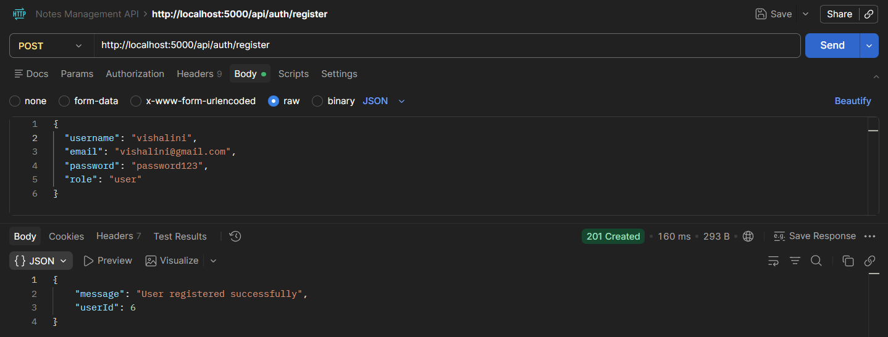
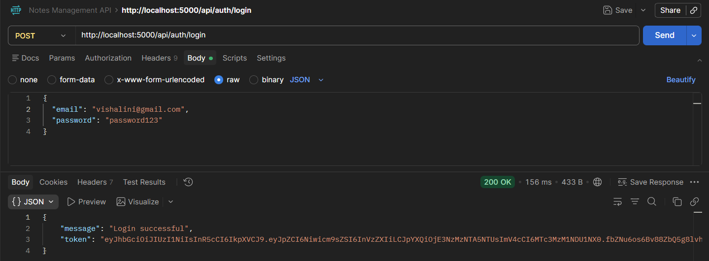
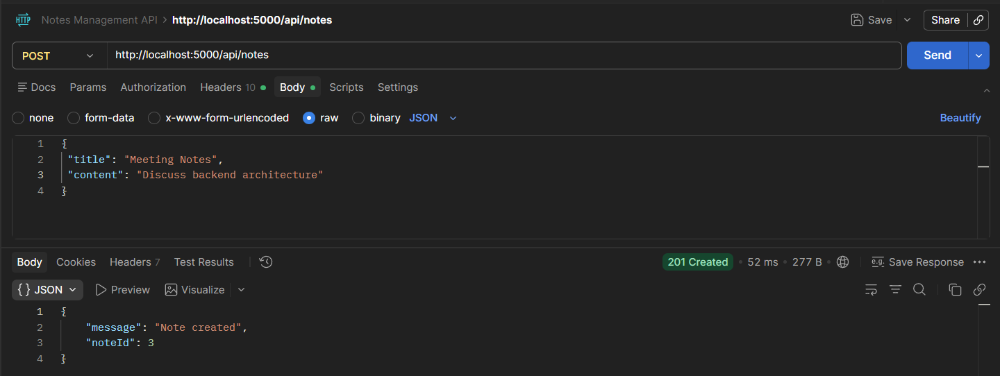
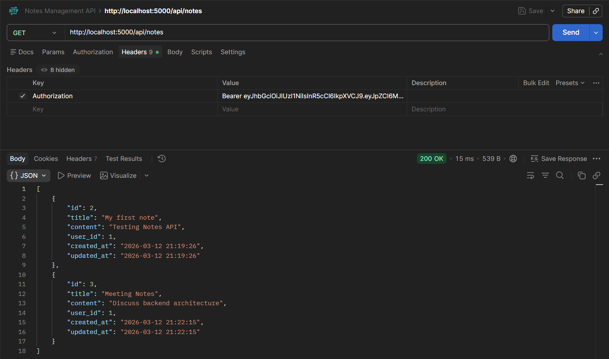

# Notes Management API

## Overview

The **Notes Management API** is a secure backend REST API that enables authenticated users to create, manage, and organize personal notes. The system enforces strict data ownership and implements role-based access control to ensure proper authorization and security.

The API supports user authentication using JSON Web Tokens (JWT), secure password hashing, input validation, and structured error handling. Administrators have elevated privileges allowing them to access and manage all notes in the system.

This project demonstrates backend engineering practices such as:

* Secure authentication and authorization
* RESTful API design
* Role-based access control
* Database interaction and schema design
* Input validation and error handling
* Environment-based configuration

The system is implemented using **Node.js with Express** and **SQLite** as the database.

---

# Technology Stack

| Layer                     | Technology           |
| ------------------------- | -------------------- |
| Backend Framework         | Express.js           |
| Runtime                   | Node.js              |
| Database                  | SQLite               |
| Authentication            | JSON Web Token (JWT) |
| Password Security         | bcrypt               |
| Validation                | express-validator    |
| Environment Configuration | dotenv               |
| Development Tool          | nodemon              |

---

# System Architecture

The project follows a **layered backend architecture** separating responsibilities across controllers, routes, models, and middleware.

Client Request
→ Route
→ Middleware (Authentication / Validation)
→ Controller
→ Model (Database interaction)
→ Response

This separation ensures maintainability and scalability.

---

# Project Folder Structure

```
Notes-Management-API
│
├── node_modules
│
├── Screenshots
│   ├── register.png
│   ├── login.png
│   ├── create-note.png
│   ├── get-notes.png
│
├── src
│   │
│   ├── controllers
│   │   ├── authController.js
│   │   └── notesController.js
│   │
│   ├── middleware
│   │   ├── authMiddleware.js
│   │   └── roleMiddleware.js
│   │
│   ├── models
│   │   ├── db.js
│   │   ├── userModel.js
│   │   └── noteModel.js
│   │
│   ├── routes
│   │   ├── authRoutes.js
│   │   └── notesRoutes.js
│   │
│   └── app.js
│
├── .env
├── notes.db
├── package-lock.json
├── package.json
└── README.md
```

---

# Database Schema

## Users Table

| Column   | Type    | Description     |
| -------- | ------- | --------------- |
| id       | INTEGER | Primary key     |
| username | TEXT    | Unique username |
| password | TEXT    | Hashed password |
| role     | TEXT    | user or admin   |

---

## Notes Table

| Column     | Type     | Description           |
| ---------- | -------- | --------------------- |
| id         | INTEGER  | Primary key           |
| title      | TEXT     | Note title            |
| content    | TEXT     | Note body             |
| user_id    | INTEGER  | Owner of note         |
| created_at | DATETIME | Creation timestamp    |
| updated_at | DATETIME | Last update timestamp |

Foreign Key:

```
user_id → users(id)
```

---

# Installation and Setup

## 1. Clone the Repository

```
git clone https://github.com/yourusername/notes-management-api.git
cd notes-management-api
```

---

## 2. Install Dependencies

```
npm install
```

---

## 3. Configure Environment Variables

Create a `.env` file in the root directory.

Example:

```
PORT=5000
JWT_SECRET=your_secret_key
DB_FILE=notes.db
```

---

## 4. Run the Application

Development mode:

```
npm run dev
```

Production mode:

```
npm start
```

Server will run at:

```
http://localhost:5000
```

---

# API Endpoints

## Authentication

### Register User

POST `/api/auth/register`

Request Body

```json
{
  "username": "vishalini",
  "email": "vishalini@gmail.com",
  "password": "password123",
  "role": "user"
}
```

Response

```json
{
  "message": "User registered successfully",
  "userId": 6
}
```

---

### Login User

POST `/api/auth/login`

Request Body

```json
{
  "email": "vishalini@gmail,.com",
  "password": "password123"
}
```

Response

```json
{
  "message": "Login successful",
  "token": "JWT_TOKEN"
}
```

---

# Notes API

All endpoints require:

```
Authorization: Bearer JWT_TOKEN
```

---

## Create Note

POST `/api/notes`

Request

```json
{
  "title": "Meeting Notes",
  "content": "Discuss backend architecture"
}
```

Response

```json
{
  "message": "Note created",
  "noteId": 1
}
```

---

## Get User Notes

GET `/api/notes`

Response

```json
[
   {
       {
            "id": 1,
            "title": "My first note",
            "content": "Testing Notes API",
            "user_id": 1,
            "created_at": "2026-03-12 21:19:26",
            "updated_at": "2026-03-12 21:19:26"
       },
       {    
            "id": 2,
            "title": "Meeting Notes",
            "content": "Discuss backend architecture",
            "user_id": 1,
            "created_at": "2026-03-11 21:22:15",
            "updated_at": "2026-03-11 21:22:15"
       }
   }
]
```

---

## Update Note

PUT `/api/notes/:id`

Request

```json
{
  "title": "Updated Title",
  "content": "Updated content"
}
```

---

## Delete Note

DELETE `/api/notes/:id`

---

# Role-Based Access Control

The system implements **two roles**:

### User

Permissions:

* Create notes
* Read own notes
* Update own notes
* Delete own notes

### Admin

Permissions:

* View all notes
* Delete any note in the system

Authorization is enforced using middleware that verifies the user's role from the JWT token.

---

# Security Features

### Password Hashing

Passwords are securely stored using **bcrypt hashing**.

Example:

```javascript
const hashedPassword = await bcrypt.hash(password, 10);
```

---

### Token Authentication

JWT tokens are issued during login.

Example:

```javascript
const token = jwt.sign(
  { userId: user.id, role: user.role },
  process.env.JWT_SECRET,
  { expiresIn: "1h" }
);
```

---

### Protected Routes

Authentication middleware verifies tokens before granting access.

```
Authorization: Bearer TOKEN
```

---

# Error Handling

The API returns proper HTTP status codes.

| Status Code | Meaning            |
| ----------- | ------------------ |
| 200         | Success            |
| 201         | Resource created   |
| 400         | Bad request        |
| 401         | Unauthorized       |
| 403         | Forbidden          |
| 404         | Resource not found |
| 500         | Server error       |

Example response:

```json
{
  "error": "Invalid token"
}
```

---

# Example API Requests Using cURL

## Register

```
curl -X POST http://localhost:5000/api/auth/register \
-H "Content-Type: application/json" \
-d '{"username":"john","password":"123456","role":"user"}'
```

---

## Login

```
curl -X POST http://localhost:5000/api/auth/login \
-H "Content-Type: application/json" \
-d '{"username":"john","password":"123456"}'
```

---

## Create Note

```
curl -X POST http://localhost:5000/api/notes \
-H "Authorization: Bearer TOKEN" \
-H "Content-Type: application/json" \
-d '{"title":"First Note","content":"My first note"}'
```

---

# Screenshots

The following screenshots demonstrate the API functionality tested using Postman.

### User Registration



---

### Login Request



---

### Create Note



---

### Get Notes



---

# Future Enhancements

The following improvements can be added to extend the system:

* Pagination for notes listing
* Search notes by title
* Refresh token authentication
* Swagger API documentation
* Docker containerization
* Deployment using cloud services

---
